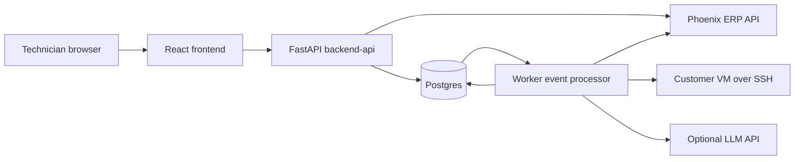
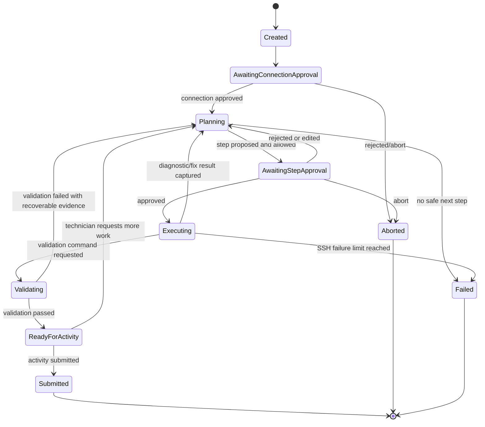

# Architecture Spec

## Goal

Design the system as a Postgres-backed, event-driven control plane that is easy to demo, safe under review, and runnable from one `docker compose up --build`.

The architecture should make the scoring evidence obvious:

- Phoenix requests prove ERP workflow.
- Postgres audit events prove every command and approval.
- Command execution logs prove troubleshooting and validation.
- Safety events prove blocked dangerous actions.
- Activity records prove complete ERP documentation.

## Scoring-Led Architecture Principles

- Optimize for categories B and C first: solving incidents safely beats UI polish.
- Treat every command as a state transition, not a casual shell call.
- Store an append-only event log for every run.
- Keep secrets only in backend environment and mounted key files.
- Generate the Phoenix activity from the audit trail, not from memory.
- Make the demo flow observable in real time.
- Keep the whole stack reproducible with Docker Compose.

## Scoring Traceability

| Rubric area | Architecture choice | Evidence produced |
| --- | --- | --- |
| A. ERP workflow | Backend-only Phoenix client with cached ticket/system snapshots | Phoenix integration log, ticket cache, activity submission event |
| B. Troubleshooting | Command execution records tied to hypotheses, fixes, and validations | Ordered commands, outputs, exit codes, validation event, activity fields |
| C. Safety and auditability | Append-only run events, safety verdicts, approval gates, redaction | Approval timeline, blocked command events, sanitized outputs |
| D. Technician control | SSE/polling event stream shown in the run console | Visible progress, pending approval cards, retry/reject/abort events |
| E. Reproducibility | Single Compose stack with API, worker, Postgres, frontend | One-command startup, durable local state, runnable tests against mocks |
| Tie-breakers | Minimal command strategy and exact event timing | Fewer unnecessary commands/restarts and shorter evaluation trail |

## Services

The single Compose stack should contain these services:

- `frontend`: React technician workspace.
- `backend-api`: FastAPI HTTP API for the frontend.
- `worker`: background event processor using the same backend codebase.
- `postgres`: durable state, audit log, outbox, cached Phoenix data, and activity drafts.

External dependencies:

- Phoenix ERP mock API.
- Customer VMs reachable over SSH.
- Optional LLM provider API.

Avoid adding Redis or a separate queue unless there is spare time. Postgres is enough for the hackathon and keeps reproducibility simple.

The LLM agent design is specified in [agent-spec.md](agent-spec.md). The short version: the LLM proposes structured next steps and writes summaries; the backend/worker owns safety, approval, SSH execution, logging, validation, and ERP submission.

The live terminal design is specified in [live-terminal-spec.md](live-terminal-spec.md). The terminal streams approved command output to the browser while also storing sanitized output chunks in Postgres.

The inspected evidence design is specified in [evidence-log-spec.md](evidence-log-spec.md). Every related log file, journal source, config file, service status, metadata check, and endpoint validation that is inspected should be recorded and shown to the technician.

The backup policy is specified in [backup-policy-spec.md](backup-policy-spec.md). Full machine backups are not part of the default flow; the app creates targeted, approved pre-change backups and rollback records for the exact files or settings it modifies.

## System Context

## Event-Driven Model

Use Postgres as both the source of truth and the lightweight event bus.

Core idea:

1. The API accepts technician actions and writes events to Postgres.
2. The API writes processable work into an outbox table.
3. The worker claims outbox rows with row locking.
4. The worker performs one side effect at a time: LLM call, safety classification, SSH command, validation, or Phoenix activity submission.
5. Every side effect appends a new audit event.
6. The frontend receives updates through Server-Sent Events or polling from the run event stream.

Preferred event transport:

- Use Postgres `LISTEN/NOTIFY` for low-latency wakeups.
- Use polling with `FOR UPDATE SKIP LOCKED` as the reliability fallback.
- Keep all durable work in the database, not in process memory.

## Event Types

Minimum event vocabulary:

- `ticket.loaded`
- `customer_system.loaded`
- `run.created`
- `connection.approval_requested`
- `connection.approved`
- `connection.rejected`
- `agent.plan_requested`
- `agent.hypotheses_updated`
- `step.proposed`
- `step.safety_classified`
- `step.approved`
- `step.edited_and_approved`
- `step.rejected`
- `command.execution_requested`
- `command.started`
- `terminal.output_chunk`
- `terminal.output_truncated`
- `evidence.source_detected`
- `evidence.source_opened`
- `evidence.finding_recorded`
- `evidence.source_redacted`
- `backup.plan_created`
- `backup.skipped_read_only`
- `backup.approval_requested`
- `backup.created`
- `backup.failed`
- `backup.restore_proposed`
- `backup.restored`
- `backup.not_applicable`
- `command.completed`
- `command.failed`
- `command.timed_out`
- `validation.requested`
- `validation.passed`
- `validation.failed`
- `activity.draft_requested`
- `activity.draft_generated`
- `activity.submitted`
- `ticket.status_updated`
- `run.aborted`
- `run.failed`

These events should be visible in the UI as a followable timeline. The user-facing text can be concise, but the stored payload should preserve enough structured data for debugging and activity generation.

## Log Model

The logs are not an afterthought. They are a scoring artifact.

### 1. Audit Event Log

Purpose:

- Jury-visible proof of human control and system actions.
- Source for the run timeline.
- Source for activity generation.

Stores:

- Timestamp.
- Actor: `technician`, `agent`, `safety_layer`, `ssh_runner`, `phoenix_client`, `system`.
- Event type.
- Human-readable summary.
- Structured JSON payload.
- Related run, ticket, step, command, and activity IDs.

Rules:

- Append-only during a run.
- Never delete or rewrite to hide mistakes.
- If something is corrected, append a new correction event.

### 2. Command Execution Log

Purpose:

- Exact record of every SSH command.
- Evidence for troubleshooting and validation.

Stores:

- Approved command text.
- Technician approval timestamp.
- Safety classification.
- Target host, port, username, and OS from customer system snapshot.
- Timeout.
- Started and completed timestamps.
- Exit code.
- Sanitized stdout and stderr.
- Output truncation marker when output is capped.
- Duration.
- Streamed output chunk references for the live terminal transcript.

Rules:

- No command executes unless linked to an approved step.
- Store sanitized output only.
- Never store private key material.
- Never run hidden commands that are absent from the log.
- Stream output live to the browser and append the same sanitized chunks to Postgres.
- If output is truncated, record the truncation explicitly.

### 3. Agent Reasoning Log

Purpose:

- Make the agent progress understandable without exposing irrelevant internal chatter.
- Preserve ranked hypotheses and evidence.

Stores:

- Problem interpretation.
- Hypotheses.
- Evidence references from command results.
- Proposed next action.
- Expected signal.
- Stop condition.

Rules:

- Store concise reasoning summaries, not verbose chain-of-thought.
- Tie claims to observed evidence where possible.
- Mark uncertainty clearly.

### 4. Integration Log

Purpose:

- Debug Phoenix, SSH, and LLM failures.
- Prove ERP calls happened.

Stores:

- Integration name.
- Operation name.
- Request timestamp.
- Response status or error class.
- Duration.
- Retry count.
- Correlation ID when available.

Rules:

- Do not store authorization headers.
- Do not store raw LLM prompts if they contain ticket/customer-sensitive data unless sanitized.
- Do not store secrets from environment variables.

### 5. Inspected Evidence Log

Purpose:

- Show every log file, journal source, config file, service status, metadata check, and endpoint validation inspected during the run.
- Explain why each source mattered.
- Link final root cause and validation claims to concrete evidence.

Stores:

- Source type and path/source name.
- Command that inspected it.
- Purpose.
- Sanitized excerpt or finding.
- Redaction marker.
- Link to command execution.
- Whether it supports hypothesis, root cause, fix choice, validation, or context.

Rules:

- Append-only.
- Store concise excerpts and findings, not whole large logs.
- Never store secret-bearing files or unredacted secret output.
- Record journal streams such as `journalctl -u nginx` even though they are not file paths.

### 6. Backup and Rollback Log

Purpose:

- Prove that persistent changes were made carefully.
- Provide rollback information for targeted file/config/permission changes.
- Avoid unsafe broad backups that copy customer data or secrets.

Stores:

- Source path or setting.
- Backup path or metadata snapshot.
- Backup command.
- Restore command proposal.
- Whether backup is persistent across reboot.
- Whether content was stored locally.
- Redaction marker.

Rules:

- No full-machine backup by default.
- No broad filesystem archives.
- No database dumps by default.
- Every backup or restore command requires safety classification and technician approval.

## Postgres Data Model

Use normalized tables for operational state and append-only events for audit.

Recommended tables:

- `technician_cache`: latest `GET /me` response metadata.
- `tickets_cache`: Phoenix ticket snapshots.
- `customer_system_cache`: SSH target snapshots for tickets.
- `runs`: current run state and timestamps.
- `run_events`: append-only audit event stream.
- `proposed_steps`: one row per agent-proposed action.
- `command_executions`: one row per approved SSH command execution.
- `command_output_chunks`: append-only sanitized stdout/stderr chunks for live terminal replay.
- `inspected_sources`: append-only ledger of log files, journal sources, configs, metadata checks, and endpoint checks inspected as evidence.
- `backup_records`: targeted pre-change backups and rollback metadata for files/settings modified during a run.
- `activity_drafts`: generated and technician-edited Phoenix activity payloads.
- `integration_requests`: Phoenix, SSH, and LLM request metadata.
- `outbox_events`: durable work queue for the worker.
- `redaction_events`: optional table recording what kinds of secrets were redacted.

Important constraints:

- A `command_execution` must reference a `proposed_step`.
- A command cannot enter `execution_requested` unless the step is approved.
- A step cannot be approved if safety verdict is `blocked`.
- A run can have only one active pending step.
- Activity submission requires a completed validation event or explicit technician override event.
- Every inspected source must reference the command execution that produced it.
- Every medium-risk persistent change should reference a backup record or explicit `backup.not_applicable` event.

Indexes should support:

- Loading events by `run_id` and timestamp.
- Finding unprocessed outbox rows.
- Listing runs by ticket.
- Looking up latest ticket and customer system snapshots.

## Run State Machine

## Request and Event Flows

### Ticket List Flow

1. Frontend calls backend `GET /api/tickets`.
2. Backend calls Phoenix `GET /api/v1/me/tickets`.
3. Backend stores sanitized ticket snapshots in `tickets_cache`.
4. Backend appends `ticket.loaded` events only when relevant to an opened/run ticket.
5. Frontend displays list and error states.

### Start Run Flow

1. Technician opens a ticket.
2. Backend loads ticket and customer system from Phoenix.
3. Backend creates `runs` row and `run.created` event.
4. Backend emits `connection.approval_requested`.
5. Frontend shows SSH target and asks technician to approve connection.

### Proposed Command Flow

1. Worker receives `agent.plan_requested`.
2. Agent proposes one structured step.
3. Safety layer classifies the proposed command.
4. Backend stores `proposed_steps` row.
5. Backend appends `step.proposed` and `step.safety_classified`.
6. Frontend shows command, purpose, evidence target, and risk verdict.
7. Technician approves, edits, rejects, retries, or aborts.

### Approved Command Flow

1. API receives approval.
2. API appends `step.approved` or `step.edited_and_approved`.
3. API creates an outbox row for `command.execution_requested`.
4. Worker claims the outbox row.
5. Worker verifies run state, approval, and safety verdict again.
6. Worker creates a `command_executions` row in `running` state and appends `command.started`.
7. Worker runs exactly that command over SSH.
8. Worker redacts each stdout/stderr chunk before it is stored or streamed.
9. Worker writes `terminal.output_chunk` events and `command_output_chunks` rows as output arrives.
10. Worker detects inspected log/file/evidence sources from the command and output.
11. Worker writes `inspected_sources` rows and `evidence.*` events.
12. Worker updates final `command_executions` metadata.
13. Worker appends `command.completed`, `command.failed`, or `command.timed_out`.
14. Worker schedules the next `agent.plan_requested` or `validation.requested`.

### Activity Submission Flow

1. Worker or API generates an activity draft from audit events and command summaries.
2. Frontend shows editable required fields.
3. Technician edits and submits.
4. Backend posts `POST /api/v1/activities/create` to Phoenix.
5. Backend appends `activity.submitted`.
6. Backend optionally patches ticket status to `DONE`.
7. Backend appends `ticket.status_updated`.

## Safety Gates

The architecture must enforce safety in the backend and worker, not only in the UI.

Required execution gates:

- Run must not be `aborted`, `failed`, or `submitted`.
- Step must exist and belong to the run.
- Step must have a non-blocked safety verdict.
- Technician approval must be recorded after safety classification.
- Edited commands must be reclassified before execution.
- Command text executed must exactly match the approved command text.
- Command must have a timeout and output cap.
- Command output must be redacted before persistence.

Blocked commands should still be logged as blocked safety events so the jury can see the guardrail working.

## Activity Generation from Logs

The activity generator should read the audit log and command execution log, then produce:

- `summary`: one sentence describing restored customer benefit.
- `root_cause`: technical cause supported by evidence.
- `actions_taken`: ordered diagnosis and fix steps, not just final fix.
- `commands_summary`: command classes and key commands, without secret output.
- `validation_result`: concrete proof after service restart/reload or reboot when used.

The generator should also read `inspected_sources` so root cause and validation claims cite the relevant logs/files checked. It should not invent root cause. If evidence is incomplete, it should state the best-supported cause and mention uncertainty in the draft for technician correction.

## Frontend Log Experience

The UI should present logs in three layers:

- Timeline: readable audit events for the demo.
- Live terminal: approved commands with streamed sanitized stdout/stderr while they run.
- Logs & files checked: every inspected evidence source with path/source, purpose, finding, redaction marker, and linked transcript.
- Command details: command, approval, risk, exit code, duration, completed transcript.
- Activity basis: selected evidence that will go into the Phoenix activity.

The technician should be able to:

- Expand/collapse command output.
- Watch command output stream live.
- See every related log file, journal source, config file, metadata check, and endpoint validation inspected during the run.
- Pause auto-scroll without stopping execution.
- See blocked commands.
- See who approved each command and when.
- See when the agent is planning, waiting, executing, validating, or failed.
- Abort from any active state.
- Enter a manual command that becomes a proposed step and still requires safety classification and approval.

This directly supports category D while providing category C evidence.

## Docker Compose Requirements

Everything we own should start with one command.

Compose services:

- `postgres` with a named volume.
- `backend-api` with Phoenix, SSH, database, and LLM environment variables.
- `worker` with the same environment variables and read-only key mount.
- `frontend` with only `VITE_API_BASE`.

Required mounts:

- `./keys:/keys:ro` for SSH private keys.

Required environment:

- Phoenix base URL and token.
- SSH private key path.
- SSH username default.
- Database URL.
- Optional LLM settings.
- Command timeout and output limit settings.

Startup behavior:

- Backend should fail clearly if database is unavailable.
- Backend should report missing Phoenix/SSH/LLM settings as actionable configuration errors.
- Worker should be restart-safe and resume pending outbox work.
- Frontend should show backend unavailable state rather than a blank page.

## Reliability and Timeouts

Phoenix API:

- Short connect timeout.
- Bounded request timeout.
- Retry transient 5xx and network errors.
- Do not retry unsafe POST blindly unless idempotency is handled or duplicate activity submission is prevented.

SSH:

- Connection timeout.
- Command timeout.
- Output cap.
- Non-interactive commands only.
- Clear error for auth, host unreachable, timeout, and command non-zero exit.

LLM:

- Request timeout.
- Structured output validation.
- Fallback deterministic diagnostic plan if unavailable.
- Never execute LLM output without safety classification and technician approval.

Worker:

- Outbox row locking.
- Retry with bounded attempts for transient failures.
- Dead-letter status after repeated failures.
- Append failure events with clear messages.

## Secret Handling

Secrets live only in:

- `.env` on the host.
- Docker environment for backend and worker.
- `/keys` read-only mount.

Secrets must not appear in:

- Frontend environment.
- Browser responses.
- Postgres logs.
- Audit event payloads.
- Command output.
- Activity fields.
- Screenshots.
- Git repository.

Redaction should happen before storing any external output.

## Testing Architecture

Scoring-critical tests:

- Safety blocks hard-fail commands.
- Edited commands are reclassified.
- Unapproved commands cannot execute.
- Aborted runs cannot execute pending outbox work.
- Activity draft includes all required Phoenix fields.
- Redaction removes token, password, and private-key-like values.
- Worker can resume an unprocessed outbox command.
- Fake SSH run produces command log and next agent step.
- Phoenix 401, 404, 422, timeout, and empty-ticket responses produce usable UI/backend states.

## Implementation Priority

1. Postgres schema and run event append API.
2. Phoenix client and ticket UI.
3. Run creation and connection approval.
4. Safety layer and manual approved-command execution.
5. Worker outbox processing.
6. Agent proposal loop.
7. Validation and activity generation.
8. SSE/polling timeline.
9. Tests, README, and secret scan.

This order builds the judged backbone before spending time on UI refinement.
